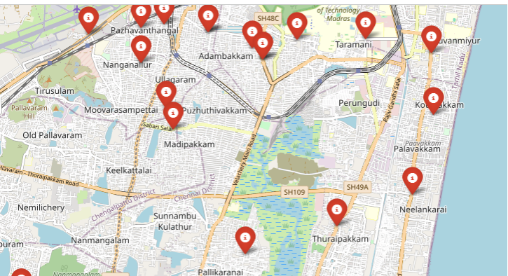
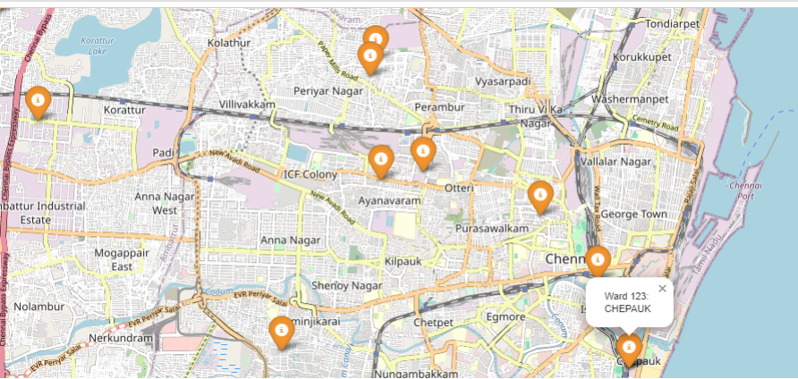

# ChennaiFloodMappingML

A research project that combines **machine learning** and **spatial data** to predict and visualize flood-prone zones in Chennai, India. This work was carried out as part of my postgraduate research (In Second Semester) and is especially designed to help citizens and real estate decision-makers understand flood risks in various wards of Chennai.

Flooding is a major threat in coastal cities like Chennai. This project creates a **ward-level flood risk prediction system** using both **machine learning models** and **deep learning techniques**, visualized via interactive maps.

---

## 📌 About the Project

- 🧪 **Type**: Academic Research Project (MCA, VIT Chennai)
- 🏙️ **Focus Area**: Chennai Metropolitan Area
- 💻 **Tech Stack**: Python, Scikit-learn, TensorFlow, Pandas, Folium
- 📊 **Models Used**:
  - Decision Tree
  - Random Forest
  - Gradient Boosting
  - Deep Neural Network (DNN)

---

## 📌 Custom Dataset

Unlike existing studies that rely on precompiled datasets, this project used a **self-created dataset**. All data was **manually collected and built** into a custom dataset, which includes:

- Chennai ward-level spatial data
- Historical rainfall and cyclone data
- Elevation and proximity to rivers (Adyar, Cooum, Kosasthalaiyar)
- Water level data from past flood events

This custom dataset is key to localized and accurate flood risk prediction.

---

## 🌍 Output: Flood Risk Map

Flood zones were visualized using **Folium** in interactive maps. You can view:

- 🔴 `FloodMapRedZone.html`: Wards with **high flood risk**
- 🟠 `FloodMapOrangeZone.html`: Wards with **moderate flood risk**

These maps help inform safer real estate planning and disaster preparedness.

Below is a sample output showing high flood risk zones in Chennai:

(Interactive maps are available in the repo as `.html` files.)

---

## 📈 Model Performance

| Model              | MAE   | MSE    |
|-------------------|-------|--------|
| Decision Tree      | 3.331 | 18.365 |
| Random Forest      | 2.896 | 11.270 |
| Gradient Boosting  | 2.976 | 11.715 |
| Neural Network     | 3.231 | 13.956 |

---

## 📄 Research Paper

This work is based on an **unpublished research paper** authored as part of my MCA degree.

> 📝 **Note:** The full paper is not publicly uploaded to avoid misuse.  
> You may request access by emailing: [shivani.jain2023@vitstudent.ac.in](mailto:shivani.jain2023@vitstudent.ac.in) or [anandan.p@vit.ac.in](mailto:anandan.p@vit.ac.in) or at my personal email: [shivanijwork@gmail.com](mailto:shivanijwork@gmail.com)

---

## 🛡️ License

This repository and its contents (including code and dataset) are licensed under:

© 2025 Shivani Jain

> This means: you may **view and share** with credit, but **no commercial use or modification** is allowed.

---

